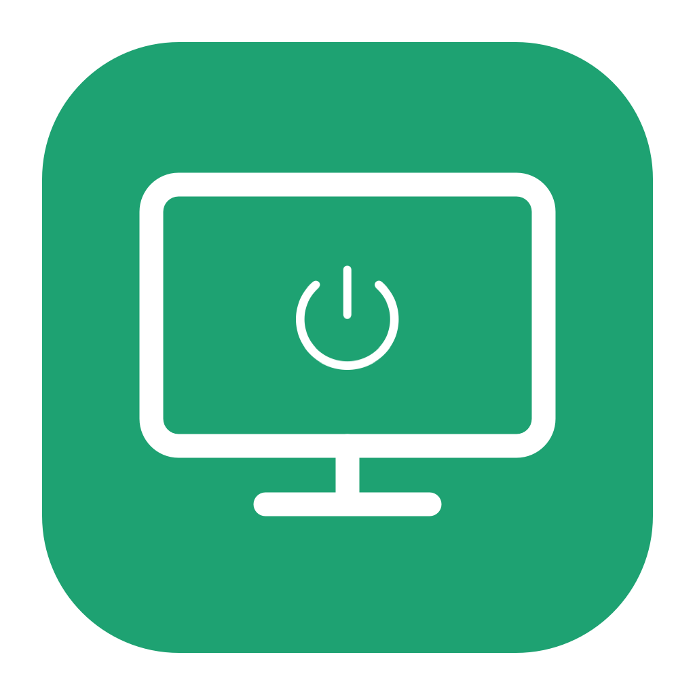

# 轻醒 · LightWake

屏幕休息，任务继续。

LightWake 是一款原生 macOS 屏幕工具：关闭显示器时防止电脑因闲置而睡眠，意外唤醒后自动倒计时熄屏，双击即可恢复正常使用。

| 关闭屏幕 | 开启屏幕 |
| :---: | :---: |
|  |  |

## 功能

| 组件 | 使用方式 |
| --- | --- |
| 关闭屏幕 | 双击后提示 3 秒，提示平移缩小到桌面左上角，再倒数 2 秒关闭显示器。 |
| 临时唤醒 | 自动熄屏模式中，屏幕实际唤醒后提示 3 秒，剩余 17 秒在左上角显示数字；到时再次关闭显示器。 |
| 锁屏后解锁 | 锁屏期间由 macOS 管理显示器，轻醒不因倒计时到期而关屏；成功解锁后再开始完整的 20 秒。 |
| 开启屏幕 | 双击即可取消自动熄屏和当前倒计时，恢复正常使用。 |
| 轻醒按键 | 执行指定按键的屏幕规则，供键盘、鼠标和外部映射工具调用。 |
| 轻醒设置 | 配置“哪个按键 → 哪个应用 / 项目文件夹”；显示旧版防亮屏保护的停用状态。 |

重复的唤醒通知不会延长 20 秒时限。倒计时结束前不会再次弹出大提示；多显示器会各自显示提示与左上角数字。


## 构建

需要 Apple silicon Mac、macOS 26 或更新版本、完整 Xcode 26 和 Python 3.10 或更新版本。首次使用 Xcode 时，请先完成其初始化，并确认命令行工具选中了完整 Xcode。

在仓库根目录执行：

```sh
python3 scripts/build.py
```

构建产物使用本机临时签名，路径如下：

```text
apps/screen-guard/build/关闭屏幕.app
apps/screen-guard/build/开启屏幕.app
apps/screen-guard/build/轻醒按键.app
apps/screen-guard/build/轻醒设置.app
```

## 安装与使用

1. 将上述 `.app` 复制到“应用程序”。更新时先退出正在运行的对应应用。
2. 在 Finder 中为“关闭屏幕”和“开启屏幕”制作替身，拖到桌面，便于双击使用。
3. 双击“关闭屏幕”进入自动熄屏模式；需要持续使用电脑时，双击“开启屏幕”退出模式。

自动熄屏模式运行期间，菜单栏中的显示器图标也提供“开启屏幕（退出模式）”和“立即关闭屏幕”。退出模式会释放防止闲置睡眠的声明，电脑随后遵循原有电源设置。

关闭显示器与锁屏是不同的系统行为。LightWake 保留系统的密码和锁屏设置：普通后台任务可继续运行，需要操作桌面窗口的任务可能仍需解锁。它防止的是闲置睡眠，不保证合盖、手动选择睡眠或电量耗尽时继续运行，也不会自动恢复已经完成或等待用户输入的任务。

## 按键规则：哪个按键，打开哪个目标

在“轻醒设置 → 按键规则”中，新建一条规则：

1. 选择键盘快捷键、鼠标按键或外部映射按键。键盘和鼠标可以直接录制具体按键；手柄等映射工具使用该规则的独立调用命令。
2. 选择“亮屏并打开目标”或“切换屏幕；恢复亮屏时打开目标”。可限制为只在熄屏、锁屏或自动熄屏模式中执行。
3. 选择目标应用，也可指定项目文件夹。不同按键可以打开不同目标。
4. 勾选“启用这条规则”并保存。键盘和鼠标规则需要通过“授权输入监控”按钮手动授权；原按键仍会传给其他应用。

新建规则默认停用。普通屏幕唤醒不执行任何目标；只有匹配该规则的按键或映射入口才执行。亮屏后若需要密码，会等你正常解锁、桌面稳定后再打开这次按键指定的应用和项目。关闭或删除规则后停止执行，无需修改源码或重新构建。

Joy-Con 的具体按键和 Karabiner 映射由独立的手柄项目维护。旧版打开“轻醒按键.app”的绑定保留为 `legacy-toggle` 兼容入口，可在设置里给这条规则选择应用。新映射使用每条规则的独立地址，避免把所有按键指向同一个目标。使用方法、接口规范和兼容规则见 [按键规则与调用接口](docs/input-rules.md)。

## Codex 防亮屏保护的兼容性状态

**2.5.3 修正了轻醒自身对解锁的干扰。** 旧版在锁屏亮起 20 秒后仍请求再次关屏，可能打断较慢的密码或指纹验证。现在锁屏、会话不可用时不发出关屏命令，包括旧计时器和重试；正常解锁后才恢复桌面的完整倒计时。指定按键已退出模式时仍保持退出，不因解锁重启。

这意味着锁屏期间的意外亮屏交由 macOS 自身超时处理。轻醒目前不是全系统的软件唤醒拦截器，也不能保证任何软件都无法亮屏；不会通过强制关回密码界面来冒充这种能力。原因与接口限制见 [排查结论](docs/wake-and-unlock.md)。

**2.5.2 已停用进程暂停保护。** 实测出现指纹匹配成功后解锁界面卡住、需要强制重启；同时系统记录被暂停的电脑操作服务无响应。两者的完整因果链尚未验证，当前版本禁止继续使用冻结服务的方式防亮屏。

新版本启动时会关闭旧版的开启选择；设置页保留停用说明和旧版关闭入口，不能重新开启。新脚本即使读到旧的开启配置，也不再暂停进程。按键规则、目标应用和项目文件夹选择不受影响。

任务仍可使用附带的只读桌面检查和 `quiet-sky.mjs` 包装器，在熄屏、锁屏时延后桌面调用。该检查不能拦截 Codex 主程序自身的所有亮屏请求。轻醒不会自动解锁或开启屏幕历史记录。

旧版移除、保留的任务检查及验证限制见 [防亮屏保护](docs/quiet-protection.md)。

## 验证

```sh
# 逻辑与集成检查，不实际关闭屏幕
python3 scripts/test.py

# 额外短暂显示提示与收起动画，需要可用的桌面会话
python3 scripts/test.py --visual
```

实现细节见 [架构说明](docs/architecture.md)。仓库包含屏幕工具的源码、图标和构建脚本，构建目录与本地运行状态不纳入版本控制。

CPU、内存、功率与磁盘容量小组件属于独立项目 [环见 · RingView](https://github.com/mxymalay/RingView)。
