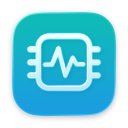

# 轻醒 · LightWake

屏幕休息，任务继续。

LightWake 是一套原生 macOS 桌面工具：在关闭显示器时防止电脑因闲置而睡眠，并用通知中心小组件查看系统状态。



## 功能

| 组件 | 使用方式 |
| --- | --- |
| 关闭屏幕 | 双击后提示 3 秒，提示平移缩小到桌面左上角，再倒数 2 秒关闭显示器。 |
| 临时唤醒 | 自动熄屏模式中，屏幕实际唤醒后提示 3 秒，剩余 17 秒在左上角显示数字；到时再次关闭显示器。 |
| 开启屏幕 | 双击即可取消自动熄屏和当前倒计时，恢复正常使用。 |
| 系统状态 | 原生通知中心小组件，显示 CPU、内存、功率估算、电池预计续航和磁盘容量。提供详细横排、详细竖排、简洁横排。 |

重复的唤醒通知不会延长 20 秒时限。倒计时结束前不会再次弹出大提示；多显示器会各自显示提示与左上角数字。


## 构建

需要 Apple silicon Mac、macOS 26 或更新版本、完整 Xcode 26 和 Python 3.10 或更新版本。首次使用 Xcode 时，请先完成其初始化，并确认命令行工具选中了完整 Xcode。

在仓库根目录执行：

```sh
python3 scripts/build.py
```

构建产物使用本机临时签名，路径如下：

```text
apps/screen-guard/build/关闭屏幕.app
apps/screen-guard/build/开启屏幕.app
apps/system-widget/build/系统状态.app
```

如需在 Xcode 中打开小组件工程，先生成当前 SDK 对应的本地适配文件：

```sh
python3 apps/system-widget/make_project.py
```

再打开 `apps/system-widget/SystemStatus.xcodeproj`。更换 Xcode / SDK 后需重新运行此命令；干净克隆中不包含生成的适配目录。

## 安装与使用

1. 将上述三个 `.app` 复制到“应用程序”。更新时先退出正在运行的对应应用。
2. 在 Finder 中为“关闭屏幕”和“开启屏幕”制作替身，拖到桌面，便于双击使用。
3. 打开“系统状态”一次，查看预览；然后打开通知中心 → 编辑小组件 → 系统状态，选择样式并拖到电池小组件附近。

自动熄屏模式运行期间，菜单栏中的显示器图标也提供“开启屏幕（退出模式）”和“立即关闭屏幕”。退出模式会释放防止闲置睡眠的声明，电脑随后遵循原有电源设置。

关闭显示器与锁屏是不同的系统行为。LightWake 保留系统的密码和锁屏设置：普通后台任务可继续运行，需要操作桌面窗口的任务可能仍需解锁。它防止的是闲置睡眠，不保证合盖、手动选择睡眠或电量耗尽时继续运行，也不会自动恢复已经完成或等待用户输入的任务。

## 数值与刷新

小组件显示采样时刻的数据，点击右上角 ↻ 可请求重新采样。自动刷新由 macOS 调度，应用请求约 15 分钟后的刷新，不保证固定频率或逐秒更新。

| 指标 | 口径 |
| --- | --- |
| CPU | 两次系统计数之间的全机使用率，归一化为 0–100%。 |
| 内存 | 按匿名内存、不可换出内存与压缩内存计算的使用量，扣除可清除部分；可能与活动监视器口径不同。 |
| 功率 | 插电时显示经电压、电流校验的输入功率估算；电池供电时显示放电功率。它不是插座功率计，也不是累计能耗。 |
| 预计续航 | 使用系统提供的电池剩余时间；随负载变化，插电时显示已接电源。 |
| 磁盘 | 用户主目录所在卷的已用、总量与可用容量，不把额外的可清理空间估算计入可用量。 |

系统没有提供有效读数时显示“—”或对应状态，不补造数值。

简洁版的原生模糊背景使用了 WidgetKit 未公开的接口声明，可能受 macOS / Xcode 更新影响。构建脚本从本机 SDK 生成仅位于 `build/` 的编译适配文件，不修改 SDK，也不在仓库中分发 SDK 文件。更多实现说明见 [架构说明](docs/architecture.md)。

## 验证

```sh
# 逻辑与集成检查，不实际关闭屏幕
python3 scripts/test.py

# 额外短暂显示提示与收起动画，需要可用的桌面会话
python3 scripts/test.py --visual
```

屏幕工具和小组件独立运行，数据采集在本机完成。仓库包含源码、图标和构建脚本，构建目录与本地运行状态不纳入版本控制。
